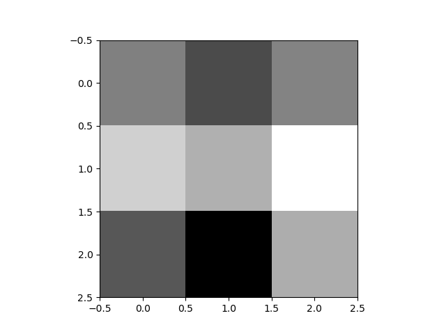

# Sobel Filter/Operator (Edge Detection)

Let's create a tool to detect edges of an image! To do so we'll use the Sobel operator/filter (there are other techniques out there, e.g. Canny edge detector). The matrices associated with the kernels we'll be using are given by:

Think of Gx and Gy as maps of the form , where we take in a 3 by 3 patch of image (denoted by ), do some operation on it (using the matrices shown above), and return a real number (the value of the pixel for the output image).

So, for example, if we are given the following patch of grayscale image:

which is really the matrix:

Then the output from the operations is:

and

To apply the Sobel operation to that patch of image we want to calculate:

This number will be the pixel contained in the output image. For now it's ok to have values which are out of the [0,255] range because at the very end we will normalize the image values. Notice that the output will be always greater than or equal to zero.

We do this operation for the entire input image and create a new image based on these outputs just describe above.

This completes the application of the edge detection technique. If you are interested I have a couple of videos showing some details on YouTube:
https://www.youtube.com/watch?v=0oIESKKokPc and https://www.youtube.com/watch?v=eifdexvpnq0
